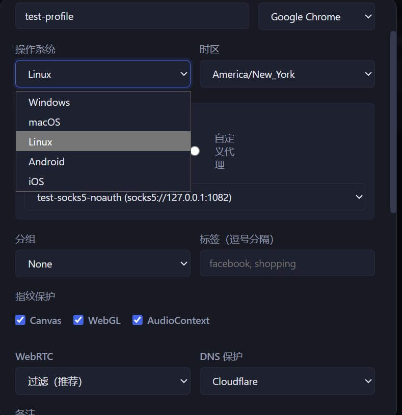
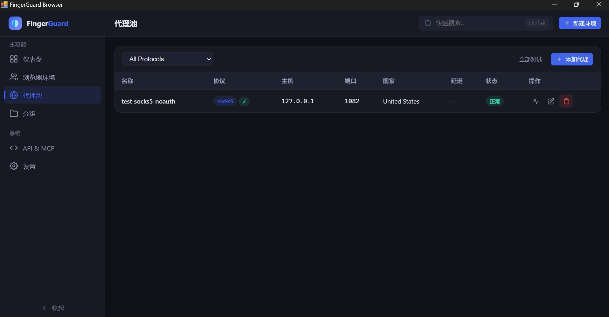

# FingerGuard Browser — 隐私保护指纹浏览器

[](https://github.com/yourusername/FingerGuardBrowser/actions/workflows/build.yml)
[](https://www.python.org/)
[](LICENSE)

FingerGuard Browser 是一款基于 Chromium 的轻量级指纹浏览器，专注于隐私保护与多账号隔离。无需注册登录，完全免费，适用于外贸电商、海外社媒运营、自动化测试以及任何需要浏览器指纹隔离的场景。

> **声明**：本项目仅用于合法的隐私保护、自动化测试与多账号管理。请遵守当地法律法规及目标网站的服务条款。

---

## 产品截图

### 浏览器环境 / 指纹配置



### 代理池管理



---

## 核心特性

| 模块 | 说明 |
| --- | --- |
| **23 维指纹伪装** | Canvas、WebGL、AudioContext、Client Hints、WebRTC、时区、语言、字体、屏幕、电池、地理位置、存储配额、性能计时、CDP 反检测等 |
| **代理池** | 支持 HTTP/HTTPS/SOCKS5/SOCKS4 等 15+ 协议；支持 GeoIP 自动同步时区、语言、地理位置 |
| **WebRTC 保护** | 过滤真实 IP，注入代理出口 IP 作为虚假 ICE candidate，避免“无 IP”特征 |
| **拟人化行为** | 贝塞尔曲线鼠标、模拟真人打字（含错字纠正）、自然滚动、空闲微动 |
| **Cookie 生命周期** | 启动时注入、关闭时导出，支持跨环境迁移 |
| **批量操作** | 批量启动、批量编辑、批量停止 |
| **移动设备模拟** | Android / iOS 平台 UA、触控、GPU 渲染器 |
| **本地 API & MCP** | 127.0.0.1 绑定 + API Key 鉴权，可被 Claude、Cursor 等 AI 代理调用 |
| **独立 Windows 安装包** | 无需 Python 环境，解压或安装即可运行 |

---

## 快速开始

### 方式一：下载 Windows 安装包（推荐）

1. 访问 [Releases](https://github.com/yourusername/FingerGuardBrowser/releases) 页面。
2. 下载 `FingerGuardBrowser-Windows.zip`（便携版）或 `FingerGuardBrowser-Setup.exe`（安装版）。
3. 解压/安装后，双击 `FingerGuardBrowser.exe` 或 `FingerGuardBrowser-quiet.bat` 启动。
4. 用户数据（数据库、日志、Chrome 缓存）自动存放在 `%LOCALAPPDATA%\FingerGuardBrowser`，不会写入安装目录。

> **系统要求**：Windows 10/11，已安装 [WebView2 Runtime](https://developer.microsoft.com/microsoft-edge/webview2/)（Windows 11 默认自带）。

### 方式二：从源码运行

```bash
# 1. 克隆仓库
git clone https://github.com/yourusername/FingerGuardBrowser.git
cd FingerGuardBrowser

# 2. 创建虚拟环境（推荐）
python -m venv venv
venv\Scripts\activate

# 3. 安装依赖
pip install -r requirements.txt

# 4. 运行
python main.py
```

---

## 项目结构

```
FingerGuardBrowser/
├── main.py                      # 程序入口
├── requirements.txt             # Python 依赖
├── FingerGuardBrowser.spec      # PyInstaller 构建配置
├── scripts/
│   ├── build_exe.bat            # Windows 便携版构建脚本
│   └── build_installer.iss      # Inno Setup 安装包脚本
├── src/
│   ├── api/                     # 本地 REST API + MCP 服务
│   ├── browser/                 # Chromium 启动、Cookie、CDP 注入
│   ├── fingerprint/             # 指纹生成与注入脚本（含 test_page.html）
│   ├── profiles/                # 分组管理
│   ├── proxy/                   # 代理池与校验
│   ├── storage/                 # SQLite 持久化
│   ├── utils/                   # 浏览器检测、日志、路径工具
│   └── web/                     # 轻量级 Web UI（pywebview）
├── tests/                       # 105+ 单元测试
└── docs/screenshots/            # 产品截图
```

---

## 开发说明

### 运行测试

```bash
python -m pytest tests/ -q
```

当前测试覆盖：

- 浏览器管理（创建、启动、关闭、Cookie 提取）
- 数据库与迁移
- 代理池与代理校验
- 指纹注入（Canvas、WebGL、AudioContext、Client Hints）
- 加密与凭证管理
- 分组与批量操作

### 构建 Windows 安装包

```bash
# 1. 构建便携目录
scripts\build_exe.bat

# 2. 使用 Inno Setup 编译安装包（可选）
# 打开 scripts\build_installer.iss，点击 Build
```

构建产物位于 `dist/`：

- `dist/FingerGuardBrowser-Windows/` — 便携目录
- `dist/FingerGuardBrowser-Windows.zip` — 便携压缩包
- `dist/FingerGuardBrowser-Setup.exe` — 安装包

---

## 隐私与数据安全

- **本地优先**：所有配置文件、数据库、Cookie、凭证均保存在本地，默认不上传云端。
- **敏感信息脱敏**：代理密码、Cookie 值在 API 响应中默认掩码处理。
- **API 边界**：本地服务仅绑定 `127.0.0.1`，通过 API Key 鉴权，并具备速率限制与 CORS 校验。
- **持久化隔离**：每个浏览器环境拥有独立的 Chrome User Data 目录，互不共享 Cookie、LocalStorage、缓存。

---

## 技术栈

- **后端**：Python 3.11+、标准库 HTTP 服务器、SQLite（WAL 模式）
- **前端**：原生 HTML/CSS/JS，无前端框架，轻量渲染
- **浏览器引擎**：undetected-chromedriver + Selenium
- **GUI**：pywebview（WebView2 on Windows），替代 PyQt5，体积减少约 95%
- **安全**：cryptography（Fernet AES-256）

---

## 待实现（Roadmap）

- [ ] RPA 自动化录制器
- [ ] 多窗口同步器（Window Synchronizer）
- [ ] 云端配置同步 / 团队共享
- [ ] WebSocket 实时状态推送（当前为轮询）
- [ ] 自定义 Chromium 内核编译以支持 C++ 级指纹补丁

---

## 贡献指南

1. Fork 本仓库。
2. 从 `main` 分支创建功能分支：`git checkout -b feature/your-feature`。
3. 提交改动并确保测试通过：`python -m pytest tests/ -q`。
4. 提交 Pull Request，等待 CI 通过。

---

## License

MIT License — 详见 [LICENSE](LICENSE)。

---

## 联系方式

- GitHub Issues：[https://github.com/yourusername/FingerGuardBrowser/issues](https://github.com/yourusername/FingerGuardBrowser/issues)
- 邮箱：请替换为项目公开邮箱
